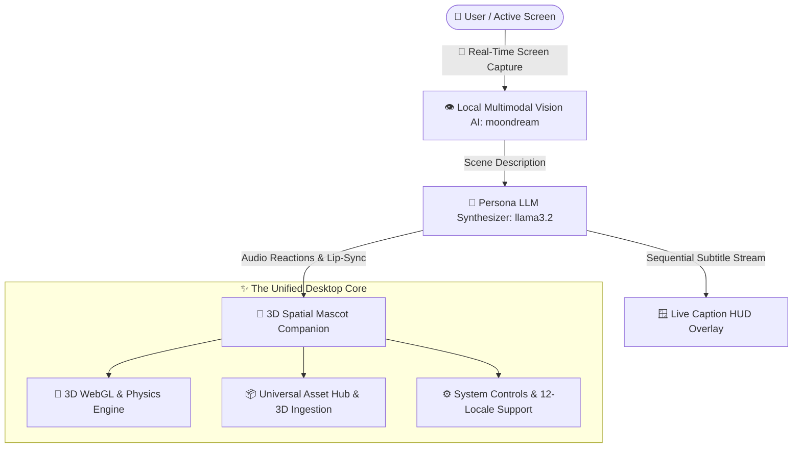
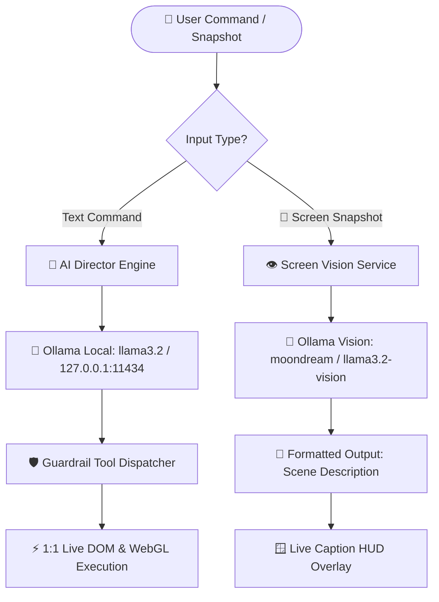

# MascotCaption 3D: Real-Time Screen Auto-Captioning with 3D Mascot Companion 🤖🐰💬

A high-performance, transparent, interactive **3D Desktop Mascot & Real-Time Screen Auto-Captioning Engine** for Windows powered by **Electron**, **Three.js**, **Local Multimodal Vision AI**, and the **AI Function Director & Neural LLM Engine**.

> 📖 **Full User Manual:** For complete guides on Blender viewport navigation, custom 3D model loading, FPS camera flight, physics tossing, dynamic battery saver mode, and 12-language localization, please see **[USER_MANUAL.md](USER_MANUAL.md)**.

---

## ⚡ Core Systems & Studio Capabilities



### 1. 🤖 AI Function Director (Tab 1)
* **Pure Conversational Chat Interface**: Streamlined, zero-clutter live conversational window with auto-scroll and quick action badges.
* **Dynamic AI Engine Mode Indicator (`#ai-mode-indicator`)**:
  * `🟢 Local LLM (llama3.2)` — Live when connected to local neural models (Ollama, LM Studio) or cloud endpoints (Groq, OpenRouter, DeepSeek, OpenAI).
  * `⚡ Fallback Mode` — Seamlessly active offline via the ultra-fast built-in heuristic semantic parser.
* **Auto-Start Local LLM Daemon**: Automatically launches the local Ollama background service on boot (`127.0.0.1:11434` with `llama3.2`).

### 2. 📦 Universal Asset Hub & Ingestion (Tab 2)
* **Central Drag-and-Drop Ingestion**: Universal dropzone supporting 3D Models (`.glb`, `.gltf`, `.fbx`, `.obj`) and Textures (`.png`, `.jpg`, `.webp`, `.svg`).
* **Pooled 3D Snapshot Renderer**: Automatically captures beauty-angle thumbnail snapshots for 3D GLTF models with zero VRAM leaks.
* **Cross-Tab Ingestion**: Automatically propagates imported assets into the Mascot file holder grid.

### 3. 🎨 3D Mascot & Studio (Tab 3)
* **Standardized File Holder Grid**: Instant 1-click selection across procedural 3D models and custom imported GLTF/GLB models:
  * 🤖 **Cyber Android** (`.HUMANOID` • 100% Original IP procedural humanoid with 4 skeletal animation cycles: `Idle Breathing`, `Cheering Wave`, `Victory Dance`, and `Look Around`).
  * 🐰 **Default Bunny** (`.MASCOT` • Procedural cute clay vinyl bunny with physics reactions and toss physics).
  * 📦 **Custom 3D Models** (`.GLB` / `.GLTF` • Drop any custom rigged model into the asset hub).
* **Skeletal Animation Selector**: Live animation clip dropdown with smooth cross-fading, idle bobbing dynamics, and 3D physics tossing (Hold `D` + Drag).
* **🧪 Screen Vision AI & Live Overlays (Incubator Labs)**:
  * **🪟 Independent Live Caption HUD Window ([caption.html](caption.html))**: Draggable, frameless, transparent floating subtitle HUD with customizable styling and click-through mode.
  * **📢 Independent Sponsor & Ad Banner Window ([banner.html](banner.html))**: Dedicated floating overlay for rotating sponsor banners, stream announcements, and clickable URL links.
  * **🧠 2-Stage Vision &rarr; LLM Caption Synthesizer**: Multimodal vision (`moondream`) + text synthesis (`llama3.2`) with 11 commentary personas and offline TTS voice matching.

### 4. ⚙️ System & Preferences Configuration Hub (Tab 4)
* **Centralized Neural LLM Settings**: Provider presets, endpoint URLs, model names, API keys, and connection testing.
* **Global Parameters**: Window width/height ($30\text{px}$ to $3840\text{px}$), model scale ($0.1\times$ to $5.0\times$), target frame rate ($15\text{–}240\text{ FPS}$), dynamic battery saver, and idle frame rate caps.
* **100% Zero-Missing 12-Language Localization**: Full translation parity across English, Chinese (Simplified/Traditional), Japanese, Korean, French, German, Spanish (EU/LATAM), Italian, Portuguese, and Russian.

---

## 🏛️ The "$O(1)$ Complexity" UI Philosophy

Traditional desktop software becomes bloated and unusable over time ($O(N^2)$ complexity growth) as every new feature introduces new menus, sliders, and buttons.

This app implements the **Universal File Holder Standard (`.studio-select-card`)**:
1. **Uniform Visual Contract**: Every selectable asset (Mascots, Models, and imported 3D assets) uses an identical card layout.
2. **Minimalism by Design**: Only essential companion and auto-captioning tools are kept active. Adding new assets introduces **0 new UI complexity**—they are simply ingested as file cards or directed via natural language.

---

## 🤖 Local Neural LLM & Vision Setup



### 1. Built-in Local Text Model (Automatic)
* On application launch, [`main.js`](main.js) automatically starts `ollama.exe serve` on `http://127.0.0.1:11434` with `llama3.2`.

### 2. Local Vision AI Models (100% Private)
To activate local multimodal screen vision, choose any open-source vision model in Ollama:
```powershell
# 🌙 Moondream (Recommended: Ultra-fast & lightweight, 800MB)
ollama run moondream

# 🦙 Meta Llama 3.2 Vision (High capability)
ollama run llama3.2-vision

# 👁️ LLaVA (Open-source visual instruction)
ollama run llava
```

---

## 🚀 Quick Start & Development

### 1. Install Dependencies
```powershell
npm install
```

### 2. Launch Development Mode
```powershell
node ./node_modules/electron/cli.js .
```

### 3. Run Automated Unit Tests (16 Suites)
```powershell
node tests/run_tests.mjs
```
*Coverage: SettingsManager Defaults & Fallbacks, PhysicsEngine Kinematics, 12-Locale Key Parity, AppStore Reactive State, EventBus Channel Routing, GPUAssetManager VRAM Disposal, Preload Security Bridge, SoundManager Volume Normalization, SceneStageManager Model Fallback Resilience, AI Director Heuristic NLP & Prompt Scenarios, ToolRegistry Guardrails, AssetRegistryManager 3D Ingestion, HumanoidMascotBuilder Skeletal Rigging, ScreenVisionService Multimodal AI, VisionCaptionSynthesizerService Multi-Persona TTS, and Floating HUD Overlays (Subtitles & Sponsor Banner).*

---

## 📦 Building the Standalone Executable

To package the standalone Windows binary into the single canonical folder:

```powershell
Get-Process | Where-Object { $_.Path -like "*DesktopPet*" } | Stop-Process -Force -ErrorAction SilentlyContinue; node ./node_modules/electron-packager/bin/electron-packager.js . DesktopPet --platform=win32 --arch=x64 --ignore="DesktopPet-win32-x64|build_tmp|tests|\.git" --overwrite; Copy-Item steam_appid.txt -Destination DesktopPet-win32-x64\ -Force
```

The output executable is packaged directly at:
```
DesktopPet-win32-x64/
  ├── DesktopPet.exe         <-- Standalone Executable
  ├── steam_appid.txt        <-- Steam Overlay Support
  └── resources/app/         <-- Bundled Engine Assets
```

To run the standalone application:
```powershell
Start-Process "DesktopPet-win32-x64\DesktopPet.exe"
```

---

## 📁 Repository Structure

```
├── .agents/                      <-- Persistent AI coding rules & context
├── assets/                       <-- Assets directory & default model files
├── locales/                      <-- 12 Language translation dictionaries (en, zh, ja, ko, etc.)
├── src/
│   ├── core/                     <-- 3D WebGL, Audio & Physics Engines
│   │   ├── director/             <-- AI Director tools, domains, telemetry & inspector
│   │   ├── AnimationLoopManager.js
│   │   ├── AppInitializer.js
│   │   ├── GPUAssetManager.js
│   │   ├── HumanoidMascotBuilder.js
│   │   ├── InteractionManager.js
│   │   ├── LightingManager.js
│   │   ├── LLMDirectorEngine.js
│   │   ├── MascotBuilder.js
│   │   ├── MascotInteractionHandler.js
│   │   ├── ModelLoader.js
│   │   ├── RenderLoopDelegates.js
│   │   ├── SceneStageManager.js
│   │   └── SoundManager.js
│   ├── managers/                 <-- AppStore, SettingsManager & EventBus
│   ├── services/                 <-- Neural & Multimodal Services
│   │   ├── ScreenVisionService.js               <-- Local Multimodal Vision Service
│   │   ├── SpeechSynthesisService.js            <-- Offline Web Speech TTS Engine & Mascot Lip-Sync
│   │   └── VisionCaptionSynthesizerService.js   <-- 2-Stage Vision -> LLM Caption Synthesizer
│   └── ui/                       <-- Studio UI & Viewport Controllers
│       ├── AIDirectorTabUI.js
│       ├── AssetHubUI.js
│       ├── BannerWindowUI.js                    <-- Floating Sponsor & Ad Banner UI Controller
│       ├── CameraViewManager.js
│       ├── FormSyncManager.js
│       ├── LiveCaptionBetaUI.js                 <-- Floating Live Caption HUD UI Controller
│       ├── PreviewGenerator.js
│       ├── ScreenVisionBetaUI.js                <-- Beta Screen Vision UI Controller
│       ├── SettingsDiagnosticsUI.js
│       ├── SettingsEventListeners.js
│       ├── SettingsPanelResizeHandler.js
│       ├── SettingsPanelUI.js
│       ├── SettingsSaveHandler.js
│       ├── SettingsUIConfigBuilder.js
│       ├── SettingsUIDelegates.js
│       ├── StudioTabManager.js
│       ├── uiUtils.js
│       └── VisionCaptionSynthesizerBetaUI.js    <-- Vision -> LLM Synthesizer UI Controller
├── banner.html                   <-- Standalone Floating Sponsor & Ad Banner Window
├── banner.js                     <-- Banner Window Controller & URL Link Handler
├── caption.html                  <-- Standalone Floating Live Caption HUD Window
├── caption.js                    <-- Subtitle HUD Controller, Themes & Font Scaler
├── index.html                    <-- Studio UI Markup & Beta Vision/Caption Cards
├── style.css                     <-- Modern Studio CSS, Glassmorphism & Animations
├── main.js                       <-- Electron Main, Window Manager & Screen Capturer
├── preload.js                    <-- Sandboxed Security & Screen Capture Bridge
├── renderer.js                   <-- Application Bootstrap & Orchestrator
├── physicsEngine.js              <-- 3D Physics Engine
├── i18nManager.js                <-- 12-Language Localization Engine
└── tests/
    └── run_tests.mjs             <-- 16-Suite Automated Unit Test Runner
```

---

## 📄 License
MIT License. Created with ❤️ for advanced 3D spatial computing, local AI vision, and desktop companionship.
