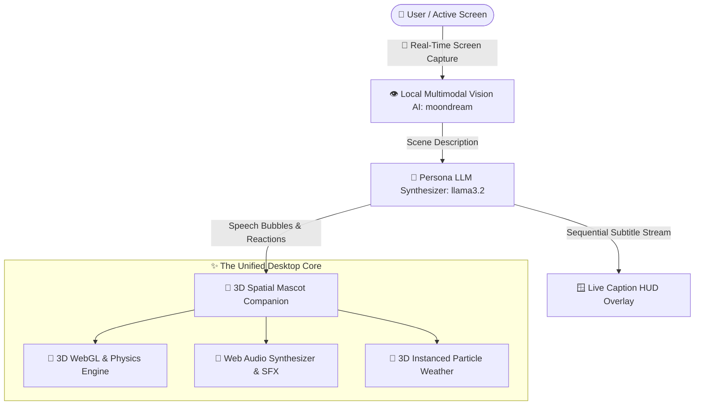
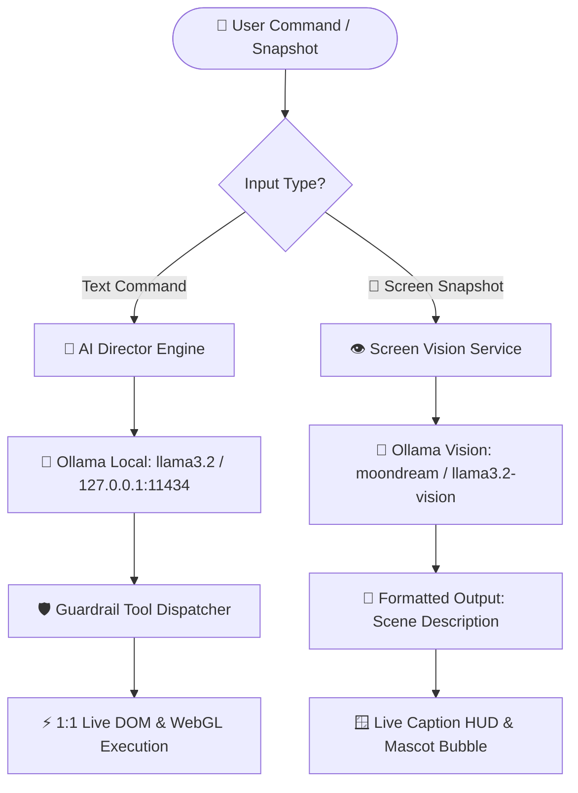

# MascotCaption 3D: Real-Time Screen Auto-Captioning with 3D Mascot Companion 🤖🐰💬

A high-performance, transparent, interactive **3D Desktop Mascot & Real-Time Screen Auto-Captioning Engine** for Windows powered by **Electron**, **Three.js**, **Web Audio API**, **Local Multimodal Vision AI**, and the **AI Function Director & Neural LLM Engine**.

> 📖 **Full User Manual:** For complete guides on Blender viewport navigation, custom 3D model loading, FPS camera flight, physics tossing, stage spotlights, dynamic battery saver mode, sakura rain particle simulation, and 12-language localization, please see **[USER_MANUAL.md](USER_MANUAL.md)**.

---

## ⚡ Core Systems & Studio Capabilities



### 1. 🤖 AI Function Director (Tab 1)
* **Pure Conversational Chat Interface**: Streamlined, zero-clutter live conversational window with auto-scroll and quick action badges.
* **Dynamic AI Engine Mode Indicator (`#ai-mode-indicator`)**:
  * `🟢 Local LLM (llama3.2)` — Live when connected to local neural models (Ollama, LM Studio) or cloud endpoints (Groq, OpenRouter, DeepSeek, OpenAI).
  * `⚡ Fallback Mode` — Seamlessly active offline via the ultra-fast built-in heuristic semantic parser.
* **Auto-Start Local LLM Daemon**: Automatically launches the local Ollama background service on boot (`127.0.0.1:11434` with `llama3.2`).

### 2. 🧪 Beta Testing & Incubator Labs (Studio Tab)
* **🪟 Independent Live Caption HUD Window ([caption.html](caption.html))**:
  * **Clean Floating Subtitle Overlay**: Draggable, frameless, transparent, always-on-top HUD window for gaming, streaming, or video subtitles.
  * **On-Window Controls**: Instant font adjustments (`A-` / `A+`), opacity toggling (`90%`, `65%`, `100%`), and color theme cycling (Sky Blue, Cyberpunk Pink, Amber Gold, Emerald Green, High-Contrast Black/White).
  * **Smooth Sequence Wiping**: Seamlessly fades in new subtitle sentences while cleanly wiping out previous text with live progress tracking (`[1/3]`, `[2/3]`, `[3/3]`).

* **🧠 2-Stage Vision &rarr; LLM Caption Synthesizer**:
  * **2-Stage Neural Pipeline**: Captures screen snapshots &rarr; Stage 1 Multimodal Vision (**`moondream`**) perceives natural scene &rarr; Stage 2 Text LLM (**`llama3.2`**) synthesizes punchy subtitle sentences with native multilingual prompt variables.
  * **11 Commentary Persona Styles**: `🎙️ Live Streamer (Hype)`, `🇹🇼 實況幹話腔 (Taiwan Slang)`, `🔥 玩梗吐槽 (Meme Roaster)`, `🎮 Pro Gamer (Tactical APM)`, `🛡️ 戰術教練 (Tactical Coach)`, `🤣 Funny & Comedy`, `🧐 Serious & Analytical`, `🐾 Cute Pet Companion`, `🌌 Poetic & Artistic`, `🍿 Cinematic Narrator`, and `⚡ Fast Action`.
  * **12-Language Target Selection**: Explicit native output directives across English, Chinese (Simplified/Traditional), Japanese, Korean, Spanish (EU/LATAM), French, German, Italian, Portuguese, and Russian with built-in zero-English bleed-through guardrails and Traditional Chinese glyph normalizer.
  * **Sentence Count Variable**: Select from `1` (quick alert) to `6` (extended story) captions.
  * **Caption Speed / Pacing**: Configure display duration per subtitle sentence (`1.0s` to `8.0s`).
  * **🔄 Auto-Loop Gaming Mode**: Continuous background capture & synthesis loop (`8s`, `15s`, `25s`, `45s`, `60s`) with **▶ Auto-Play to Subtitle HUD** for completely hands-free live stream commentary.
  * **Editable Review Text Box**: Inspect, edit, copy, or dispatch generated subtitles directly to the 3D mascot speech bubble or floating caption HUD.

### 3. 📦 Universal Asset Hub & Ingestion (Tab 2)
* **Central Drag-and-Drop Ingestion**: Universal dropzone supporting 3D Models (`.glb`, `.gltf`, `.fbx`, `.obj`), Textures & Skin Images (`.png`, `.jpg`, `.webp`, `.svg`, `.gif`), and Audio Scores (`.mid`, `.midi`, `.musicxml`, `.xml`).
* **Pooled 3D Snapshot Renderer**: Automatically captures beauty-angle thumbnail snapshots for 3D GLTF models with zero VRAM leaks.
* **Cross-Tab Ingestion**: Automatically propagates imported assets into Mascot, Texture, Atmosphere, and Music file holder grids.

### 4. 🤖 3D Mascot & Model Studio (Tab 3)
* **Standardized File Holder Grid**: Instant 1-click selection across procedural 3D models and custom imported GLTF/GLB models:
  * 🤖 **Cyber Android** (`.HUMANOID` • 100% Original IP procedural humanoid with 4 skeletal animation cycles: `Idle Breathing`, `Cheering Wave`, `Victory Dance`, and `Look Around`).
  * 🐰 **Default Bunny** (`.MASCOT` • Procedural cute clay vinyl bunny with physics reactions and toss physics).
  * 🎌 **Country Flag** (`.CLOTH` • Interactive waving cloth simulation with custom texture mapping).
  * 📦 **Custom 3D Models** (`.GLB` / `.GLTF` • Drop any custom rigged model into the asset hub).
* **Skeletal Animation Selector**: Live animation clip dropdown with smooth cross-fading, interactive SFX reactions, idle bobbing dynamics, and 3D physics tossing (Hold `D` + Drag).

### 5. 🌸 Atmosphere & Ambient Weather (Tab 4)
* **Single-Draw-Call Instanced Particles**: Single-pass GPU instanced particle systems for 3D cherry blossom petals and crystalline snowfall.
* **Standardized Weather Grid**:
  * 🌸 **Sakura Rain** (`.WEATHER` • Spring Blossom Petals)
  * ❄️ **Winter Snow** (`.WEATHER` • Glistening Crystalline Snowflakes)
  * 🌸❄️ **Dual Storm** (`.WEATHER` • Mixed Blossom & Snow Storm)
  * ☀️ **Clear Skies** (`.CLEAR` • Pure Clean View)
* **Audio-Atmosphere Sync**: Automatically activates weather storms when corresponding ambient music plays.

### 6. 🎨 Texture & Flag Cloth Dynamics (Tab 5)
* **Harmonic Cloth Wave Simulation**: Procedural waving flag with Verlet integration and real-time wind equations.
* **PBR Material Presets**: 9 built-in shader styles (Solar Eclipse, Geometric Prism, Zen Harmony, Mythic Dragon, Cyber Neon, Cosmic Nebula, Sakura Blossom, Nordic Aurora, Abyssal Wave) and custom texture image mapping.

### 7. 🎵 Sound & Classical Music Studio (Tab 6)
* **Universal Instrument Grid**: Standardized selectable cards for Grand Piano (`.MIDI`), Sheet Reader (`.XML`), Snow Wind (`.SYNTH`), Sakura Melody (`.SYNTH`), and Lo-Fi Drum Beat (`.SYNTH`).
* **Score & Track Library**: Pure Web Audio synthesis of Für Elise, Bach Minuet in G, Ode to Joy, Mozart Twinkle Variations, and imported `.mid` / `.xml` files.
* **Minimalist Transport**: Streamlined down to **Active Song Banner**, **Loop Toggle**, and **Play Button**.

### 8. ⚙️ System & Preferences Configuration Hub (Tab 7)
* **Centralized Neural LLM Settings**: Provider presets, endpoint URLs, model names, API keys, and connection testing.
* **Global Parameters**: Window width/height ($30\text{px}$ to $3840\text{px}$), model scale ($0.1\times$ to $5.0\times$), target frame rate ($15\text{–}240\text{ FPS}$), dynamic battery saver, and idle frame rate caps.
* **100% Zero-Missing 12-Language Localization**: Full translation parity across English, Chinese (Simplified/Traditional), Japanese, Korean, French, German, Spanish (EU/LATAM), Italian, Portuguese, and Russian.

---

## 🏛️ The "$O(1)$ Complexity" UI Philosophy

Traditional desktop software becomes bloated and unusable over time ($O(N^2)$ complexity growth) as every new feature introduces new menus, sliders, and buttons.

This app implements the **Universal File Holder Standard (`.studio-select-card`)**:
1. **Uniform Visual Contract**: Every selectable asset (Mascot, Cloth Texture, Weather Effect, Musical Instrument, Classical Score, and future SynapseFlow graphs) uses the identical card layout.
2. **"Tab UI as Complete History"**: The classical tabs represent a stable, loved physical archive. Adding 100 new features introduces **0 new UI complexity**—they are simply ingested as file cards or directed via natural language.

---

## 🤖 Local Neural LLM & Vision Setup



### 1. Built-in Local Text Model (Automatic)
* On application launch, [`main.js`](main.js) automatically starts `ollama.exe serve` on `http://127.0.0.1:11434` with `llama3.2`.

### 2. Local Vision AI Models (100% Private)
To activate local multimodal screen vision, choose any open-source vision model in Ollama:
```powershell
# 🌙 Moondream (Recommended: Ultra-fast & lightweight, 800MB)
ollama run moondream

# 🦙 Meta Llama 3.2 Vision (High capability)
ollama run llama3.2-vision

# 👁️ LLaVA (Open-source visual instruction)
ollama run llava
```

---

## 🚀 Quick Start & Development

### 1. Install Dependencies
```powershell
npm install
```

### 2. Launch Development Mode
```powershell
node ./node_modules/electron/cli.js .
```

### 3. Run Automated Unit Tests (16 Suites)
```powershell
node tests/run_tests.mjs
```
*Coverage: SettingsManager, PhysicsEngine, 12-Locale Parity, AppStore, EventBus, GPU VRAM disposal, Preload Security, SoundManager, FlagMeshBuilder, TextureManager, Web Audio Piano, MidiParser, MusicXml, AssetRegistryManager, ScreenVisionService, and LiveAudienceAIService.*

---

## 📦 Building the Standalone Executable

To package the standalone Windows binary into the single canonical folder:

```powershell
Get-Process | Where-Object { $_.Path -like "*DesktopPet*" } | Stop-Process -Force; node ./node_modules/electron-packager/bin/electron-packager.js . DesktopPet --platform=win32 --arch=x64 --out=build_tmp --overwrite; Copy-Item -Recurse -Force build_tmp\DesktopPet-win32-x64\* DesktopPet-win32-x64\; Copy-Item steam_appid.txt -Destination DesktopPet-win32-x64\; Remove-Item -Recurse -Force build_tmp
```

The output executable is packaged directly at:
```
DesktopPet-win32-x64/
  ├── DesktopPet.exe         <-- Standalone Executable
  ├── steam_appid.txt        <-- Steam Overlay Support
  └── resources/app/         <-- Bundled Engine Assets
```

To run the standalone application:
```powershell
Start-Process "DesktopPet-win32-x64\DesktopPet.exe"
```

---

## 📁 Repository Structure

```
├── .agents/                      <-- Persistent AI coding rules & context
├── assets/                       <-- Assets directory & default model files
├── locales/                      <-- 12 Language translation dictionaries (en, zh, ja, ko, etc.)
├── src/
│   ├── core/                     <-- 3D WebGL, Audio & Physics Engines
│   │   ├── director/             <-- AI Director tools, domains & telemetry
│   │   ├── AnimationLoopManager.js
│   │   ├── AppInitializer.js
│   │   ├── FlagMeshBuilder.js
│   │   ├── GPUAssetManager.js
│   │   ├── InteractionManager.js
│   │   ├── LLMDirectorEngine.js
│   │   ├── MascotInteractionHandler.js
│   │   ├── SakuraRainManager.js
│   │   ├── SceneStageManager.js
│   │   ├── SnowFallManager.js
│   │   └── SoundManager.js
│   ├── managers/                 <-- AppStore, SettingsManager & EventBus
│   ├── services/                 <-- Neural & Multimodal Services
│   │   ├── LiveAudienceAIService.js             <-- Multi-Persona AI Live Stream Audience Engine
│   │   ├── ScreenVisionService.js               <-- Local Multimodal Vision Service
│   │   └── VisionCaptionSynthesizerService.js   <-- 2-Stage Vision -> LLM Caption Synthesizer
│   └── ui/                       <-- Studio UI & Viewport Controllers
│       ├── AIDirectorTabUI.js
│       ├── AssetHubUI.js
│       ├── AtmosphereTabUI.js
│       ├── FormSyncManager.js
│       ├── LiveCaptionBetaUI.js                 <-- Floating Live Caption HUD UI Controller
│       ├── PreviewGenerator.js
│       ├── ScreenVisionBetaUI.js                <-- Beta Screen Vision UI Controller
│       ├── SettingsPanelUI.js
│       ├── SettingsPanelResizeHandler.js
│       ├── SoundTabUI.js
│       ├── TextureTabUI.js
│       └── VisionCaptionSynthesizerBetaUI.js    <-- Vision -> LLM Synthesizer UI Controller
├── caption.html                  <-- Standalone Floating Live Caption HUD Window
├── caption.js                    <-- Subtitle HUD Controller, Themes & Font Scaler
├── index.html                    <-- Studio UI Markup & Beta Vision/Caption Cards
├── style.css                     <-- Modern Studio CSS, Glassmorphism & Animations
├── main.js                       <-- Electron Main, Window Manager & Screen Capturer
├── preload.js                    <-- Sandboxed Security & Screen Capture Bridge
├── renderer.js                   <-- Application Bootstrap & Orchestrator
├── physicsEngine.js              <-- 3D Physics Engine
├── i18nManager.js                <-- 12-Language Localization Engine
└── tests/
    └── run_tests.mjs             <-- 16-Suite Automated Unit Test Runner
```

---

## 📄 License
MIT License. Created with ❤️ for advanced 3D spatial computing, local AI vision, and desktop companionship.
