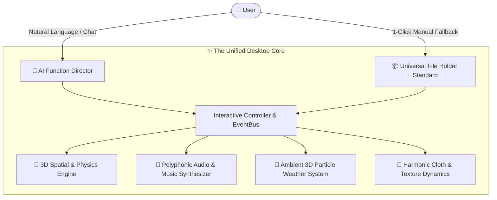
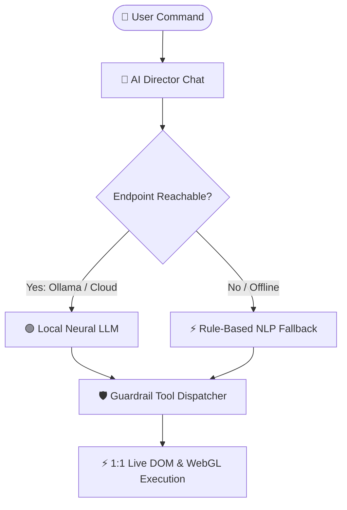

# Desktop 3D Display & Spatial AI Companion (T02 V4) 🖥️🐰✨

A high-performance, transparent, interactive **3D Desktop Spatial Companion & Atmosphere Hub** for Windows powered by **Electron**, **Three.js**, **Web Audio API**, and the **AI Function Director & Neural LLM Engine**.

> 📖 **Full User Manual:** For complete guides on Blender viewport navigation, custom 3D model loading, FPS camera flight, physics tossing, stage spotlights, dynamic battery saver mode, sakura rain particle simulation, and 12-language localization, please see **[USER_MANUAL.md](USER_MANUAL.md)**.

---

## ⚡ Core Systems & Studio Capabilities



### 1. 🤖 AI Function Director (Tab 1)
* **Pure Conversational Chat Interface**: Streamlined, zero-clutter live conversational window with auto-scroll and quick action badges.
* **Dynamic AI Engine Mode Indicator (`#ai-mode-indicator`)**:
  * `🟢 Local LLM (llama3.2)` — Live when connected to local neural models (Ollama, LM Studio) or cloud endpoints (Groq, OpenRouter, DeepSeek, OpenAI).
  * `⚡ Fallback Mode` — Seamlessly active offline via the ultra-fast built-in heuristic semantic parser.
* **Auto-Start Local LLM Daemon**: Automatically launches the local Ollama background service on boot (`127.0.0.1:11434` with `llama3.2`).

### 2. 📦 Universal Asset Hub & Ingestion (Tab 2)
* **Central Drag-and-Drop Ingestion**: Universal dropzone supporting 3D Models (`.glb`, `.gltf`, `.fbx`, `.obj`), Animated 2D Mascots (`.gif`), Textures (`.png`, `.jpg`, `.webp`, `.svg`), and Audio Scores (`.mid`, `.midi`, `.musicxml`, `.xml`).
* **Live Animated & Snapshot Previews**: Automatically renders live animated GIF previews and captures beauty-angle snapshots for 3D GLTF models with zero VRAM leaks.
* **Cross-Tab Ingestion**: Automatically propagates imported assets into Mascot, Texture, Atmosphere, and Music file holder grids.

### 3. 🐰 3D & 2D Animated Mascot Studio (Tab 3)
* **Standardized File Holder Grid**: Instant 1-click selection across procedural models (🐰 Bunny, 🎌 Country Flag), custom 3D GLTF/GLB models, and **Animated GIF Mascots (`.gif`)**.
* **Spatial GIF Billboard Engine**: Animated GIFs render on a crisp, transparent spatial plane with auto-detected aspect ratio, alpha clipping, and stage spotlight reactions.
* **Physics & Skeletal Animation**: Live animation clip dropdown with smooth cross-fading, interactive SFX reactions, idle bobbing dynamics, and 3D physics tossing (Hold `D` + Drag).

### 4. 🌸 Atmosphere & Ambient Weather (Tab 4)
* **Single-Draw-Call Instanced Particles**: Single-pass GPU instanced particle systems for 3D cherry blossom petals and crystalline snowfall.
* **Standardized Weather Grid**:
  * 🌸 **Sakura Rain** (`.WEATHER` • Spring Blossom Petals)
  * ❄️ **Winter Snow** (`.WEATHER` • Glistening Crystalline Snowflakes)
  * 🌸❄️ **Dual Storm** (`.WEATHER` • Mixed Blossom & Snow Storm)
  * ☀️ **Clear Skies** (`.CLEAR` • Pure Clean View)
* **Audio-Atmosphere Sync**: Automatically activates weather storms when corresponding ambient music plays.

### 5. 🎨 Texture & Flag Cloth Dynamics (Tab 5)
* **Harmonic Cloth Wave Simulation**: Procedural waving flag with Verlet integration and real-time wind equations.
* **PBR Material Presets**: 9 built-in shader styles (Solar Eclipse, Geometric Prism, Zen Harmony, Mythic Dragon, Cyber Neon, Cosmic Nebula, Sakura Blossom, Nordic Aurora, Abyssal Wave) and custom texture image mapping.

### 6. 🎵 Sound & Classical Music Studio (Tab 6)
* **Universal Instrument Grid**: Standardized selectable cards for Grand Piano (`.MIDI`), Sheet Reader (`.XML`), Snow Wind (`.SYNTH`), Sakura Melody (`.SYNTH`), and Lo-Fi Drum Beat (`.SYNTH`).
* **Score & Track Library**: Pure Web Audio synthesis of Für Elise, Bach Minuet in G, Ode to Joy, Mozart Twinkle Variations, and imported `.mid` / `.xml` files.
* **Minimalist Transport**: Streamlined down to **Active Song Banner**, **Loop Toggle**, and **Play Button**.

### 7. ⚙️ System & Preferences Configuration Hub (Tab 7)
* **Centralized Neural LLM Settings**: Provider presets, endpoint URLs, model names, API keys, and connection testing.
* **Global Parameters**: Window width/height ($30\text{px}$ to $3840\text{px}$), model scale ($0.1\times$ to $5.0\times$), target frame rate ($15\text{–}240\text{ FPS}$), dynamic battery saver, and idle frame rate caps.
* **100% Zero-Missing 12-Language Localization**: Full translation parity across English, Chinese (Simplified/Traditional), Japanese, Korean, French, German, Spanish (EU/LATAM), Italian, Portuguese, and Russian.

---

## 🏛️ The "$O(1)$ Complexity" UI Philosophy

Traditional desktop software becomes bloated and unusable over time ($O(N^2)$ complexity growth) as every new feature introduces new menus, sliders, and buttons.

This app implements the **Universal File Holder Standard (`.studio-select-card`)**:
1. **Uniform Visual Contract**: Every selectable asset (Mascot, Cloth Texture, Weather Effect, Musical Instrument, Classical Score, and future SynapseFlow graphs) uses the identical card layout.
2. **"Tab UI as Complete History"**: The classical tabs represent a stable, loved physical archive. Adding 100 new features introduces **0 new UI complexity**—they are simply ingested as file cards or directed via natural language.

---

## 🤖 Neural LLM Setup & Modes



### Option 1: Built-in Local Ollama (Automatic)
* On application launch, [`main.js`](main.js) automatically starts `ollama.exe serve` on `http://127.0.0.1:11434` with `llama3.2`.
* Click **`🔄 Check`** under **⚙️ System Tab $\rightarrow$ Neural LLM Configuration** to verify.

### Option 2: LM Studio (Local Port 1234)
1. Open LM Studio, load any model, and click **Start Server**.
2. In the app's **⚙️ System Tab**, choose **LM Studio Local** from the Provider dropdown.

### Option 3: Free Fast Cloud Models (Groq / OpenRouter / DeepSeek / OpenAI)
1. Open **⚙️ System Tab $\rightarrow$ Neural LLM Configuration**.
2. Select **Groq Cloud** (Fast & Free) or **OpenRouter Cloud**.
3. Paste your free API key and click **`🔄 Check`**.

---

## 🚀 Quick Start & Development

### 1. Install Dependencies
```powershell
npm install
```

### 2. Launch Development Mode
```powershell
npm start
```

### 3. Run Automated Unit Tests (15 Suites)
```powershell
npm test
```
*Coverage: SettingsManager, PhysicsEngine, 12-Locale Parity, AppStore, EventBus, GPU VRAM disposal, Preload Security, SoundManager, FlagMeshBuilder, TextureManager, Web Audio Piano, MidiParser, MusicXml, AssetRegistryManager (GIF Mascot Detection), and LLMDirectorEngine.*

---

## 📦 Building the Standalone Executable

To package the standalone Windows binary into the single canonical folder:

```powershell
npm run build
```

The output executable is packaged directly at:
```
DesktopPet-win32-x64/
  ├── DesktopPet.exe         <-- Standalone Executable
  ├── steam_appid.txt        <-- Steam Overlay Support
  └── resources/app/         <-- Bundled Engine Assets
```

To run the standalone application:
```powershell
Start-Process "DesktopPet-win32-x64\DesktopPet.exe"
```

> [!TIP]
> **Testing Cold Boots & Clean State**: Remember to remove the `assets/` folder after rebuild if you want a clean test environment (`Remove-Item -Recurse -Force assets`). The application automatically regenerates all required default assets, textures, and configs on launch, making this ideal for verifying fresh installations.

---

## 📁 Repository Structure

```
├── .agents/                      <-- Persistent AI coding rules & context
├── assets/                       <-- Assets directory & default model files
├── locales/                      <-- 12 Language translation dictionaries (en, zh, ja, ko, etc.)
├── src/
│   ├── core/                     <-- 3D WebGL, Audio & Physics Engines
│   │   ├── director/             <-- AI Director tools, domains & telemetry
│   │   ├── AnimationLoopManager.js
│   │   ├── AppInitializer.js
│   │   ├── FlagMeshBuilder.js
│   │   ├── GPUAssetManager.js
│   │   ├── InteractionManager.js
│   │   ├── LLMDirectorEngine.js
│   │   ├── MascotInteractionHandler.js
│   │   ├── SakuraRainManager.js
│   │   ├── SceneStageManager.js
│   │   ├── SnowFallManager.js
│   │   └── SoundManager.js
│   ├── managers/                 <-- AppStore, SettingsManager & EventBus
│   └── ui/                       <-- Studio UI & Viewport Controllers
│       ├── AIDirectorTabUI.js
│       ├── AssetHubUI.js
│       ├── AtmosphereTabUI.js
│       ├── FormSyncManager.js
│       ├── PreviewGenerator.js
│       ├── SettingsPanelUI.js
│       ├── SettingsPanelResizeHandler.js
│       ├── SoundTabUI.js
│       └── TextureTabUI.js
├── index.html                    <-- Studio UI Markup
├── style.css                     <-- Modern Studio CSS & Animations
├── main.js                       <-- Electron Main & Ollama Auto-Start Daemon
├── preload.js                    <-- Sandboxed Security Bridge
├── renderer.js                   <-- Application Bootstrap & Orchestrator
├── physicsEngine.js              <-- 3D Physics Engine
├── i18nManager.js                <-- 12-Language Localization Engine
└── tests/
    └── run_tests.mjs             <-- 15-Suite Automated Unit Test Runner
```

---

## 📄 License
MIT License. Created with ❤️ for advanced 3D spatial computing and desktop companionship.

